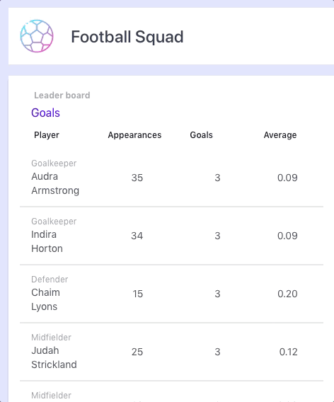

# Football squad stats

### Comments

This is a conceptual test aimed at trying out technologies such as:

- React (TypeScript).
- [Vite](https://vitejs.dev/)
- [Tailwindcss](https://tailwindcss.com/)
- [daisyUI](https://daisyui.com/)

### Installation and running the project

The project requires [Node.js](https://nodejs.org/) and [Yarn](https://yarnpkg.com/) to run.

Clone the repository:

```shell
git clone https://github.com/christianjtr/football-squad.git
```

### Demo

#### Full width mode


#### Responsive mode



### Compiles and hot-reloads for development

```
yarn dev
```

### Compiles and minifies for production

```
yarn build
```

### Lints and fixes files

```
yarn lint
yarn lint:fix
```

### Technologies

React, TypeScript, Tailwindcss, daisyUI, Vite.
